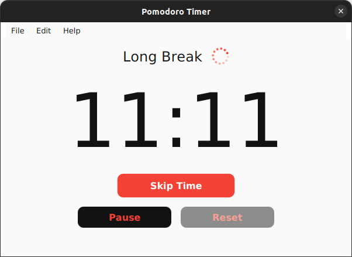
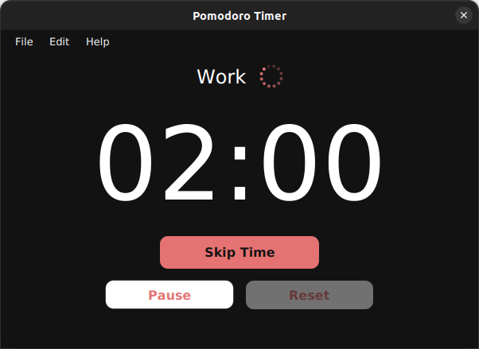
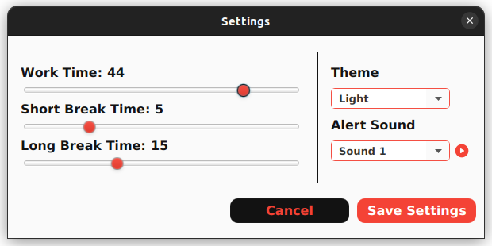
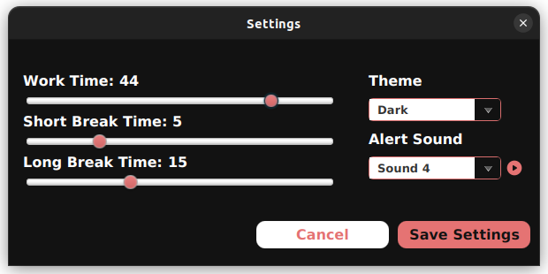

# Pomodoro Timer
A simple time management utility

### 📸 Screenshots

<div style="display: flex; flex-wrap: wrap; justify-content: space-evenly;">
    
    
    
    
</div>

### 🔩 Build & Run

##### 1.  Requirements

- [Java JDK](https://openjdk.org/)

- [Gradle](https://gradle.org/)

##### 2. Build

In the root of the project run the following command:

```bash
gradle build
```

##### 3. Run the application

Navigate to folder build/libs/ and run the follow command:

```bash
java -jar --module-path {JAVAFX_SDK_PATH}/lib --add-modules javafx.controls,javafx.fxml,javafx.media PomodoroTimer-1.0.0.jar
```

